# **ShopProject**

### **文化大學 資工1B**
### **組長: 王采風  組員: 王可陞&林皓晟**

### **※If you just want to use the program, you can skip to the end to watch the instructions**
### **(如果只是想要使用程式，可以直接跳到最後觀看使用說明)**

## Main program (Connect To Server)

### **Enroll Member 註冊會員**

**Input**
|Parameter| Type | Illustration |
| :--: | :--: | :-- |
| name_member | string | 會員名稱 |
| email_member | string | 會員的email (視作帳號使用) |
| password_member | string | 會員的密碼 |

**Database**

Insert a new data about member with attributes
_id , name_member , date_enrolled , email_member , password_member , balance_member.

*balance_member*: 會員的餘額,註冊的時候是0元

**Output**
|Parameter| Type | Illustration |
| :--: | :--: | :-- |
| _id | string | 會員的uuid |

```cpp
//註冊新的會員
string enroll_member(string name_member, string email_member, string password_member) {
    try
    {
        http::Request request{ "http://140.113.213.57:5125/enroll_member" };
        const string body = "{\"name_member\": \""+name_member+"\", \"email_member\": \"" +email_member+"\", \"password_member\": \"" +password_member+"\"}";
        const auto response = request.send("POST", body, {
            {"Content-Type", "application/json"}
            });
        //cout << "_id= " << string{response.body.begin(), response.body.end()} << '\n'; // print the result
        return string{ response.body.begin(), response.body.end() };
    }
    catch (const exception& e)
    {
        cerr << "Request failed, error: " << e.what() << '\n';
    }

    return "ERROR:ENROLL NEW MEMBER ACCOUNT FAILED!";
}
```
### **Login Member Account 登入會員**

**Input**
|Parameter| Type | Illustration |
| :--: | :--: | :-- |
| email_member | string | 會員的email,視作帳號使用 |
| password_member | string | 會員的密碼 |

**Database**

Find data about member with attributes and return 
_id , name_member , date_enrolled , email_member , password_member , balance_member.

**Output**
|Parameter| Type | Illustration |
| :--: | :--: | :-- |
| _id | string | 會員的uuid |
| name_member | string | 會員名稱 |
| date_enrolled | date | 會員的註冊日期 |
| email_member | string | 會員的email,視作帳號使用 |
| password_member | string | 會員的密碼 |
| balance_member | int | 會員的餘額 |

```cpp
//登入已有的會員帳號
string login_member(string email_member, string password_member) {
    try
    {
        http::Request request{ "http://140.113.213.57:5125/login_member" };
        const string body = "{\"email_member\": \"" + email_member + "\", \"password_member\": \"" + password_member + "\"}";
        const auto response = request.send("POST", body, {
            {"Content-Type", "application/json"}
            });
        //cout << "_id= " << string{ response.body.begin(), response.body.end() } << '\n'; // print the result
        return string{ response.body.begin(), response.body.end() };
    }
    catch (const exception& e)
    {
        cerr << "Request failed, error: " << e.what() << '\n';
    }

    return "ERROR:ENROLL NEW MEMBER ACCOUNT FAILED!";
}
```
### **Store Balance 會員儲值**

**Input**
|Parameter| Type | Illustration |
| :--: | :--: | :-- |
| _id | string | 會員的uuid |
| balance_member | int | 會員儲值的額度，必須大於0且為整數 |

**Database**

Update the balance of specified member with adding balance posted , and return the stored money for member confirmation.

**Output**
|Parameter| Type | Illustration |
| :--: | :--: | :-- |
| balance | int | 會員更新後的餘額 |

```cpp
//儲值到現有帳號
int store_balance(string _id, int balance_member) {
    
    string balance = to_string(balance_member);
    try
    {
        http::Request request{ "http://140.113.213.57:5125/store_balance" };
        const string body = "{\"_id\": \"" + _id + "\", \"balance_member\": \"" + balance + "\"}";
        const auto response = request.send("POST", body, {
            {"Content-Type", "application/json"}
            });
        //cout << "balance= " <<string{ response.body.begin(), response.body.end() } << '\n'; // print the result
        return stoi(string{ response.body.begin(), response.body.end() });
    }
    catch (const exception& e)
    {
        cerr << "Request failed, error: " << e.what() << '\n';
    }

    return -1;
}
```
### **Upload Commodity 上架商品**

**Input**
|Parameter| Type | Illustration |
| :--: | :--: | :-- |
| _id_seller | string | 販售商品的賣家會員的uuid |
| name_commodity | string | 商品名稱，可以重複 |
| price | int | 商品單價，必須大於0且為整數 |
| inventory | int | 商品的初始庫存量 |

**Database**

Insert a new data about commodity with attributes
_id,name_commodity,_id_seller,price,inventory

**Output**
|Parameter| Type | Illustration |
| :--: | :--: | :-- |
| _id_commodity | string | 商品的uuid |

```cpp
//上傳商品售賣
string upload_commodity(string _id_seller, string name_commodity,int price, int inventory) {
    string pricestr= to_string(price);
    string inventorystr = to_string(inventory);
    try
    {
        http::Request request{ "http://140.113.213.57:5125/upload_commodity" };
        const string body = "{\"_id_seller\": \"" + _id_seller + "\", \"name_commodity\": \"" + name_commodity + "\", \"price\": \"" + pricestr + "\", \"inventory\": \"" + inventorystr+"\"}";
        const auto response = request.send("POST", body, {
            {"Content-Type", "application/json"}
            });
        //cout << "_id= " << string{ response.body.begin(), response.body.end() } << '\n'; // print the result
        return string{ response.body.begin(), response.body.end() };
    }
    catch (const exception& e)
    {
        cerr << "Request failed, error: " << e.what() << '\n';
    }

    return "ERROR:ENROLL NEW MEMBER ACCOUNT FAILED!";
}
```

### **View Commodity 檢視商品**

**Database**

Find all the valid commodites and output

**Output**

Array of commodities

|Parameter| Type | Illustration |
| :--: | :--: | :-- |
| _id | string | 商品的uuid |
| name_commodity | string | 商品的名稱 |
| _id_seller | string | 賣家的uuid |
| price | int | 商品的價格 |
| inventory | int | 商品的剩餘庫存 |

```cpp
//查看商品列表
string view_commodity() {
    try
    {
        // you can pass http::InternetProtocol::V6 to Request to make an IPv6 request
        http::Request request{ "http://140.113.213.57:5125/view_commodity" };

        // send a get request
        const auto response = request.send("GET");
        //cout << string{ response.body.begin(), response.body.end() } << '\n'; // print the result
        return string{ response.body.begin(), response.body.end() };
    }
    catch (const exception& e)
    {
        cerr << "Request failed, error: " << e.what() << '\n';
    }
    return "ERROR";
}
```

### **Buy Commodity 購買商品**

**Input**
|Parameter| Type | Illustration |
| :--: | :--: | :-- |
| _id_buyer | string | 買家會員的uuid |
| _id_seller | string | 賣家會員的uuid |
| _id_commdity | string | 購買商品的uuid |
| number | int | 購買數量 |

**Database**

Count the number * price to be total trade money.
- *Buyer* balance minuse total trade money
- *Seller* balance add total trade money
- *Commodity* inventory minuse number,if inventory is zero,delete the commodity
  
**Output**
|Parameter| Type | Illustration |
| :--: | :--: | :-- |
| result | string | 交易結果 |

```cpp
//B向A購買商品
string upload_commodity(string _id_buyer, string _id_seller, string _id_commdity, int number) {
    string numberstr = to_string(number);
    try
    {
        http::Request request{ "http://140.113.213.57:5125/buy_commodity" };
        const string body = "{\"_id_buyer\": \"" + _id_buyer + "\", \"_id_seller\": \"" + _id_seller + "\", \"_id_commdity\": \"" + _id_commdity + "\", \"number\": \"" + numberstr + "\"}";
        const auto response = request.send("POST", body, {
            {"Content-Type", "application/json"}
            });
        //cout << "_id= " << string{ response.body.begin(), response.body.end() } << '\n'; // print the result
        return string{ response.body.begin(), response.body.end() };
    }
    catch (const exception& e)
    {
        cerr << "Request failed, error: " << e.what() << '\n';
    }

    return "ERROR:ENROLL NEW MEMBER ACCOUNT FAILED!";
}
```
### **Other important program**

### Spilit function

分割商品陣列的函數 Function to split an array of items

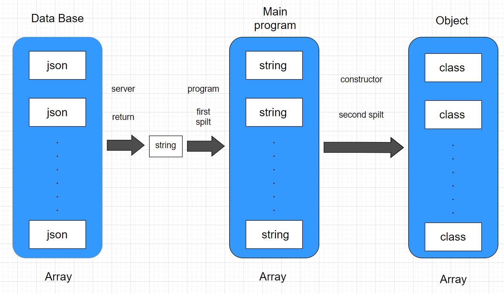

```cpp
//分割商品列表
const vector<string> split(const string& str, const string& pattern) {
    vector<string> result;
    string::size_type begin, end;

    end = str.find(pattern);
    begin = 0;

    while (end != string::npos) {
        if (end - begin != 0) {
            result.push_back(str.substr(begin, end - begin));
        }
        begin = end + pattern.size();
        end = str.find(pattern, begin);
    }

    if (begin != str.length()) {
        result.push_back(str.substr(begin));
    }
    return result;
}
```
## **GUI (QT)**
## Registration screen (註冊畫面展示)
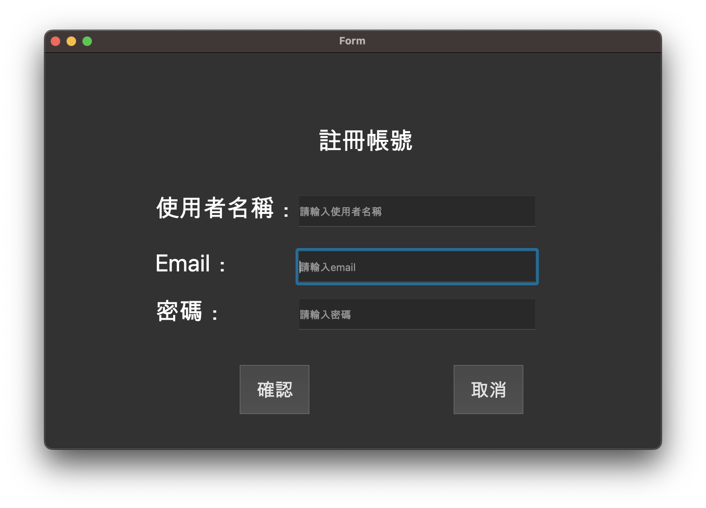
## Login screen (登入畫面展示)
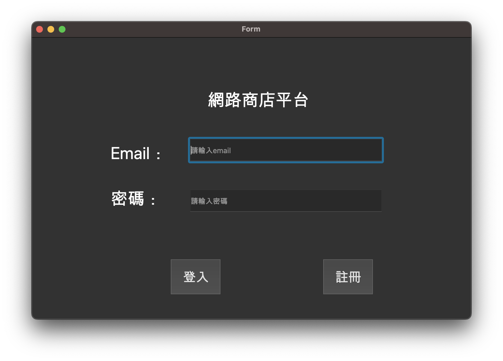
## Main function screen (主要畫面展示)
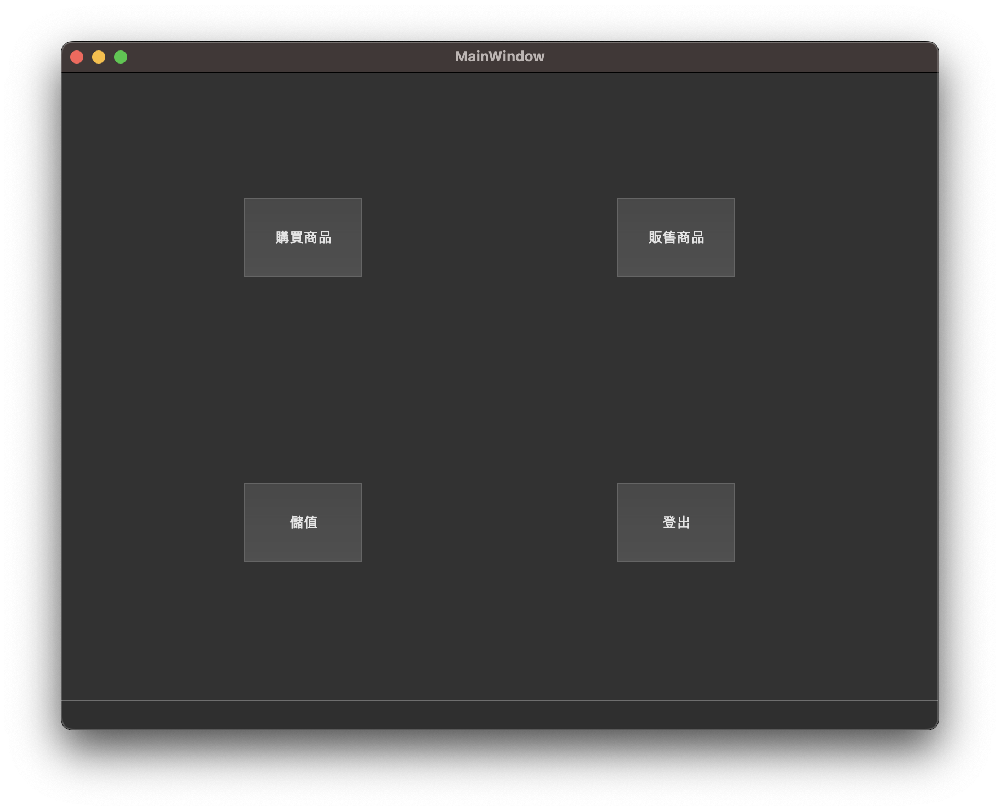
## Saving money (儲值畫面展示)
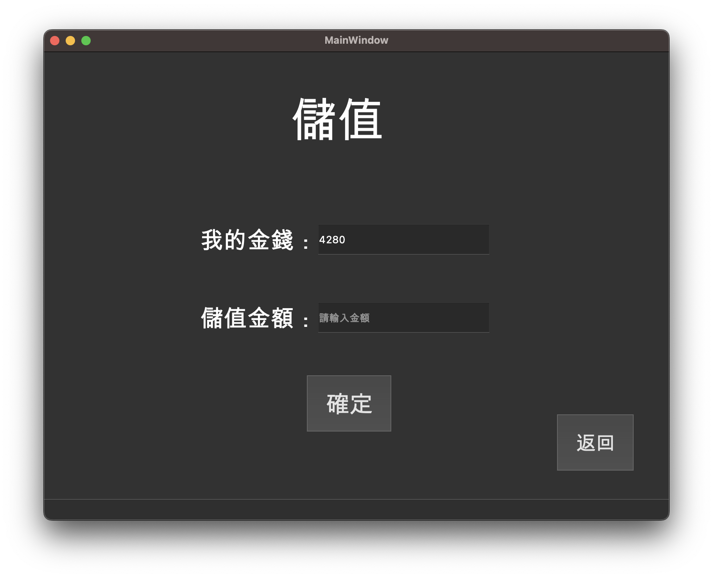
## Display commodity (商品畫面展示)
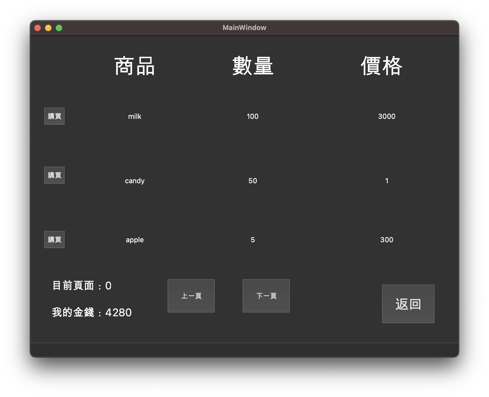
## Buy items (購買畫面展示)
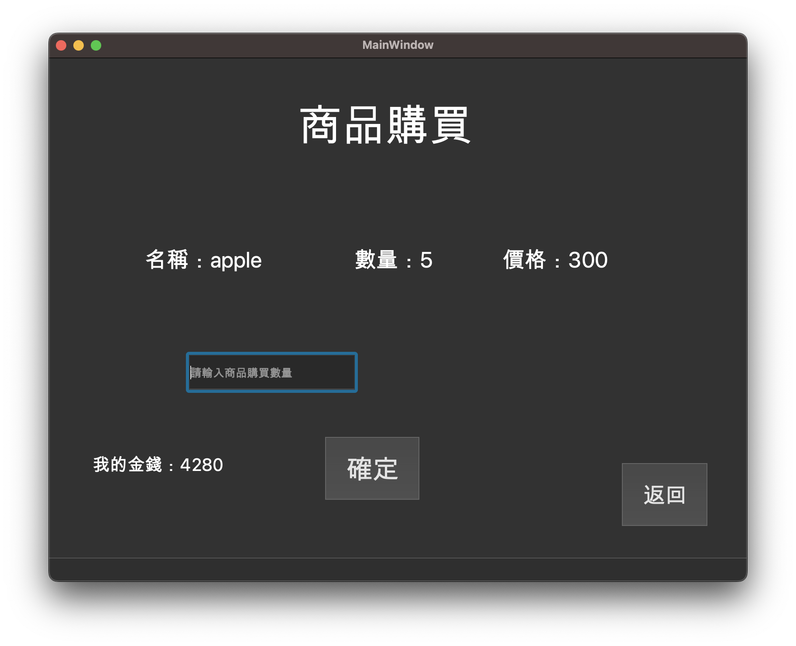
## Peddle items (販賣畫面展示)
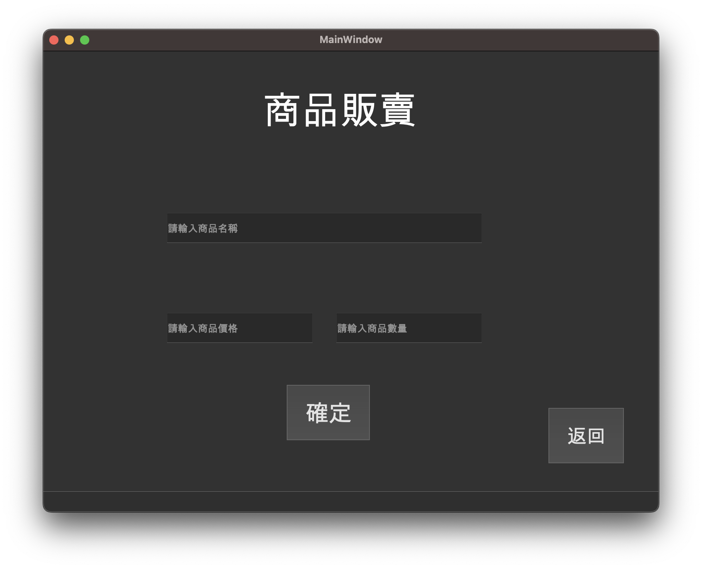
## Fool-proofing (防呆畫面展示)
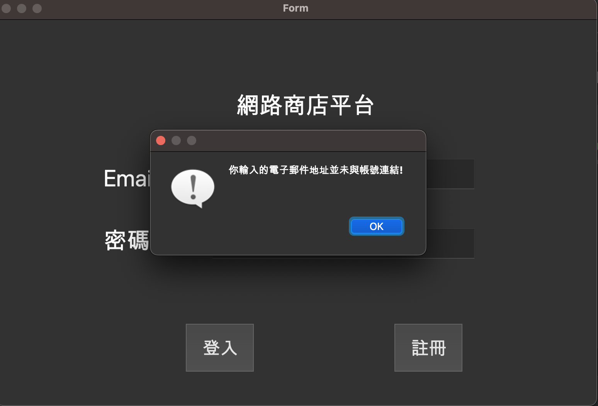
## 

## About server

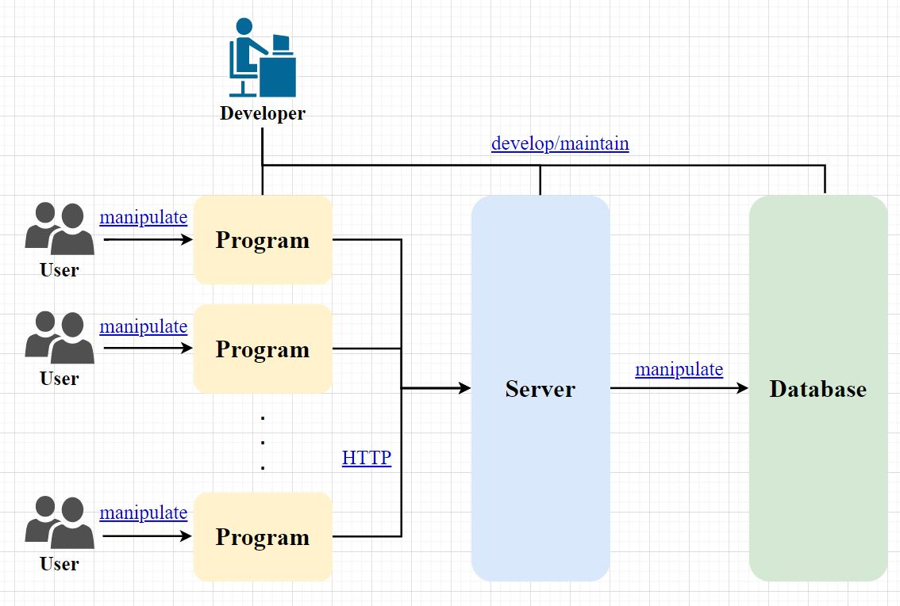

使用 **表現層狀態轉換 (Representational state transfer)** 風格建立伺服器，根基於超文字傳輸協定（HTTP）之上，提供全球資訊網絡服務。

### Features

- Uniform Interface：每個資源都可以通過**URI**存取到。也就是一個個可以認知的資源，都可以通過唯一的URI確定。
- Stateless：無狀態。
- Cacheable：可快取。
- Client-Server：客戶伺服器分離模式，任何一個客戶端與伺服器都是可替換的。
- Layered System：分層的系統，客戶端不知道他聯絡的是不是最終伺服器。
- Code on Demand（可選）：伺服器可以將能力擴充到客戶端，如果客戶端可以執行的話。這個功能是可選擇的。

#### *data_commodity_example.csv僅是範例，參考就好*
#### *data_member_example.csv僅是範例，參考就好*

#
## About client

#### *C++_Internet_store提供使用者基礎的網路商店功能*
#### *QT_Internet_shop利用QT提供GUI來讓使用者更方便使用*

|Folder| Illustration|
| :--: | :-- |
| C++_Internet_store |Provide C++ version of the basic online store function |
| QT_Internet_shop |Use QT to provide GUI to make users more convenient to use |

##
## **Instructions for use (使用說明)**

### **1.**
    我們提供兩個版本，分別是cmd的C++版和GUI的QT版，兩個都放在Client裡面
    C++檔案位置 C++_Internet_store -> store -> ResponseWithString
    QT檔案位置 QT_Internet_shop -> Internet_shop_
    ※如要使用GUI請自行下載QT來使用，如果用QT不能執行或出現錯誤是編譯器不符問題
    ※如果所有操作接正確執行了但無法使用或一直跑不出來結果，代表伺服器正在維護
    
### **2.**
    請勿惡意塞資料到伺服器上
    
### **3.**
    程式流程圖展示
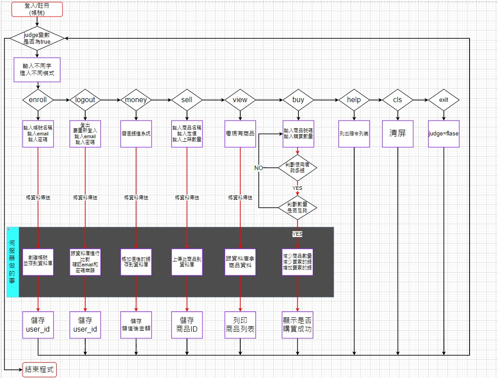
### **4.**
    程式 & 伺服器 & 資料互動 模式簡略圖
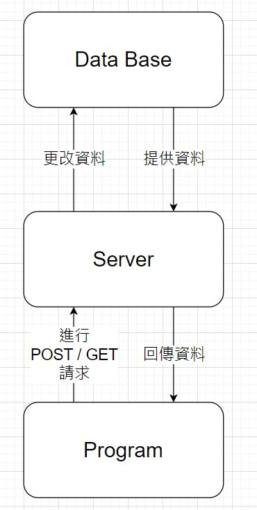    

## **About reference**

[HTTPRequest](https://github.com/elnormous/HTTPRequest)

[API](https://www.techtarget.com/searchapparchitecture/definition/RESTful-API)
